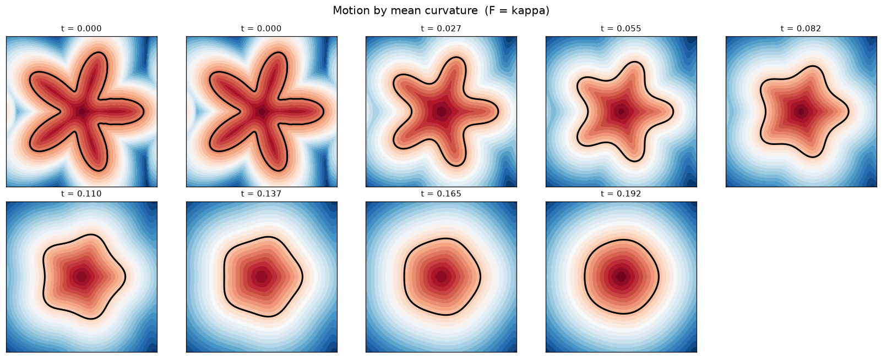
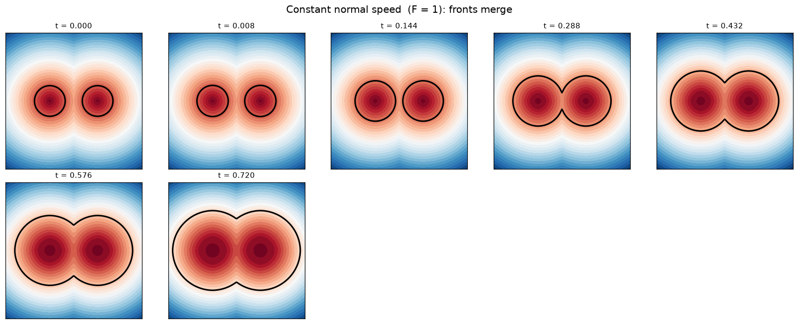

# Level Set Method — Python Demo

A small, dependency-light (numpy + matplotlib) demonstration of the
**level set method** for evolving moving interfaces, from scratch.

## The idea

Instead of tracking a curve by its own coordinates, we embed it as the
**zero level set** of a scalar field `phi(x, y, t)`:

```
interface(t) = { (x, y) : phi(x, y, t) = 0 }
```

By convention `phi` is a *signed distance function*: negative inside the
shape, positive outside, zero on the boundary. The interface then moves
with normal speed `F` by evolving the whole field:

```
    ∂phi/∂t + F · |∇phi| = 0
```

Because the curve is only *implicit*, corners, splitting, and merging are
handled automatically — no re-meshing, no marker particles to reconnect.
That robustness to **topology change** is the method's headline advantage.

## What the demo shows

| Demo | Speed `F` | Behaviour |
|------|-----------|-----------|
| Motion by mean curvature | `F = κ` (curvature) | A star smooths into a circle, then shrinks to a point |
| Constant normal speed | `F = 1` | Two separate circles grow and **merge** into one |





## Numerics (all in `level_set_method.py`)

- **Curvature term** `κ = ∇·(∇phi/|∇phi|)` — parabolic, so central
  differences are used.
- **Advective term** `F·|∇phi|` — hyperbolic, so an **upwind (Godunov)**
  scheme picks the derivative from the correct side to satisfy the
  entropy condition (keeps corners sharp, stops fronts from crossing).
- **Reinitialization** — periodically re-solve
  `phi_t + sign(phi₀)(|∇phi| − 1) = 0` to keep `phi` a signed distance
  function (`|∇phi| ≈ 1`), which keeps the other estimates accurate.

### Accuracy check

A circle under curvature flow obeys `R(t) = √(R₀² − 2t)`. The script
compares the measured zero-crossing radius against this exact solution
and prints the error (stays ~1e-3 over the run).

## Run it

```bash
pip install numpy matplotlib imageio
python level_set_method.py
```

Outputs land in `./figures/`:
- `curvature_flow.png` / `curvature_flow.gif` — star → circle → vanish
- `merging_fronts.png` — two circles merging

## Reference

S. Osher and J. A. Sethian, *Fronts propagating with curvature-dependent
speed: Algorithms based on Hamilton–Jacobi formulations*, J. Comput.
Phys. **79** (1988) 12–49.
